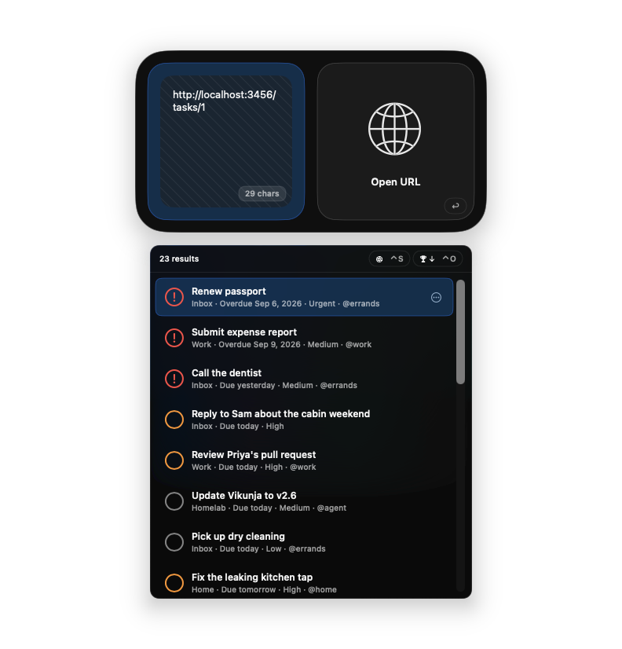
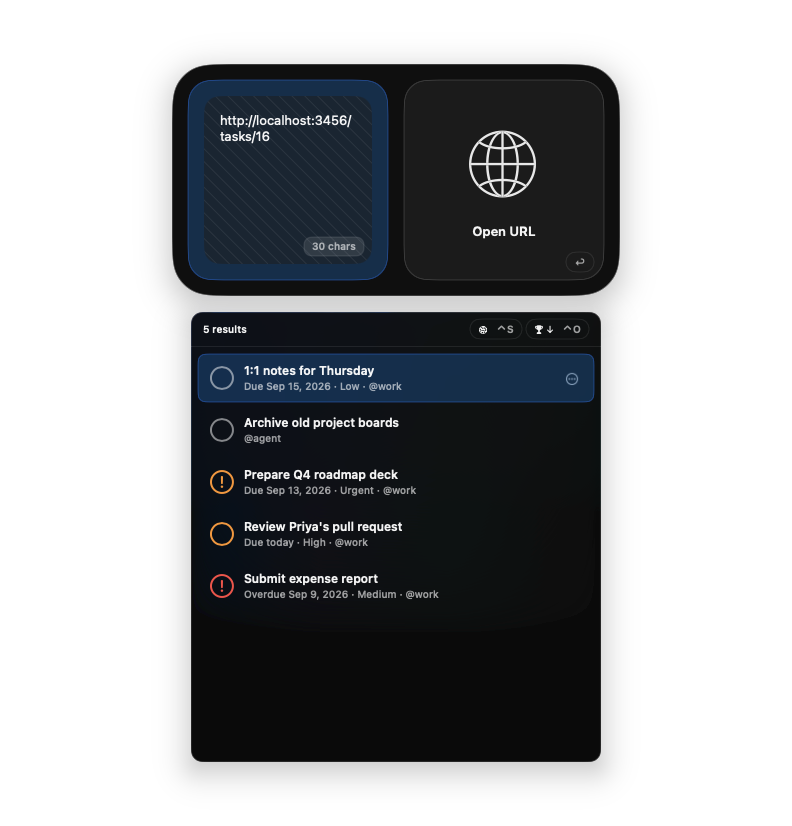
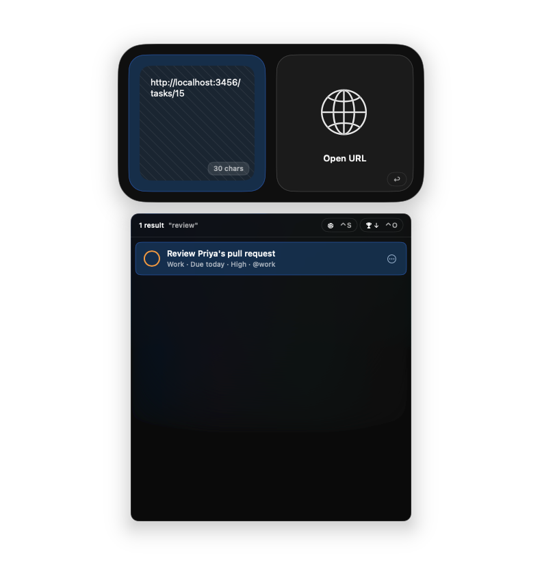
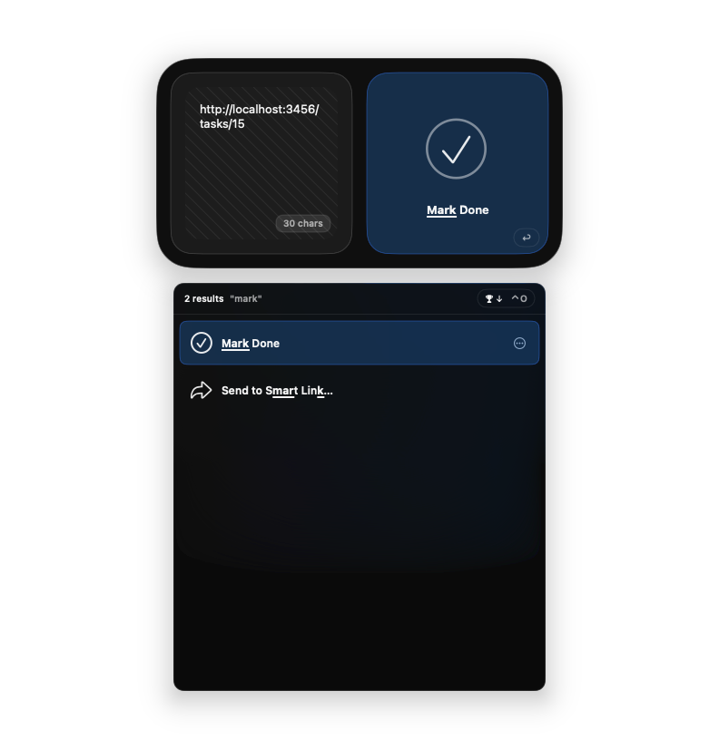
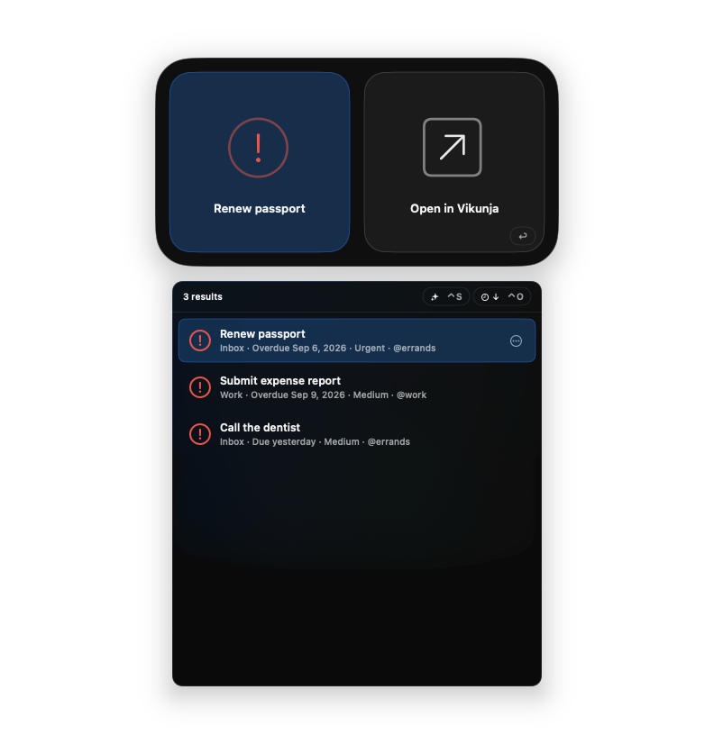

# Vikunja for Tuna

A [Tuna](https://tunaformac.com) extension for a self-hosted [Vikunja](https://vikunja.io)
task manager. Search and browse your open tasks, jump into projects, add tasks from anywhere,
and mark them done without leaving the launcher.

Requires Tuna 0.96 or later (TunaKit 1.22.0) and macOS 15.

| | |
| --- | --- |
|  |  |
|  |  |
|  |  |

## What it adds

**Sources (Settings → Sources → Vikunja)**

| Catalog | ID | What it does |
| --- | --- | --- |
| Vikunja | `vikunja` | Live-search root. Tab → **Search** (or press →) lists every open task sorted by due date and searches server-side as you type (title and description). Tab → **Browse** groups tasks as Overdue, Today, Next 7 Days, Later, and No Due Date, plus a By Project group that drills into each project. Also holds the **New Vikunja Task** quick-capture entry. |
| Projects | `vikunja.projects` | Every non-archived project. Browse into a project to see its sub-projects and open tasks. Projects are also the targets for “Add to Vikunja Project”. Enable global scope for this source if you want project names in root search. |

**Actions (`vikunja.actions`)**

| Action | Applies to | Effect |
| --- | --- | --- |
| Open in Vikunja | task, project | Opens the task or project page in your browser. Default action (Return). Copy to Clipboard yields the link. |
| Mark Done | an open task (batch OK) | `POST /tasks/{id}` with `done: true`, sending the full task back so nothing else changes. |
| Add to Vikunja | text (batch OK) | Creates one task per selected text in the **default project**. |
| Add to Vikunja Project | text, target: a project | Creates the task in the chosen project. The target pane is scoped to your projects and refreshes them when opened. |
| To… | the New Vikunja Task entry, target: typed text | Quick capture: select *New Vikunja Task*, choose *To…*, type the title. |

Task rows show the project, due state (Overdue / Due today / Due tomorrow / Due date),
priority (Vikunja scale, higher is more urgent), and labels. Overdue tasks get a red mark,
urgent ones an orange mark.

## Setup

1. In Vikunja, open **Settings → API Tokens** and create a token with **read and write**
   access to **Projects** and **Tasks** (Tasks read/write is enough for Mark Done and adding;
   Projects read is needed to list projects).
2. In Tuna, open **Settings → Extensions → Vikunja** and click **Add Connection**. Enter your
   server URL (for example `https://tasks.example.com`) and the token. Several connections
   (several servers) are supported; results are grouped per connection when there is more
   than one.
3. Optionally change **Default project** in the extension settings. It accepts a project
   title (case-insensitive) or a numeric project id and falls back to *Inbox*, then the first
   project.

## Privacy

The extension talks only to the Vikunja server you configure, over HTTPS, using your API
token from the macOS Keychain (managed by Tuna's connection store). Nothing is sent
anywhere else. Requests are only made when you search, browse, or run an action; there is no
background polling. Project lists are cached in memory for 60 seconds so task rows can show
project names.

Writes performed: creating tasks (`PUT /projects/{id}/tasks`) and completing tasks
(`GET` then `POST /tasks/{id}`). The extension never deletes anything; the live API test
suite is the only code path that deletes, and it only deletes the task it created.

## Development

```bash
make build            # Debug build
make test             # unit tests (+ live API tests when ~/.netrc has a Vikunja entry)
make install-restart  # install into ~/Library/Application Support/Tuna/ExtensionsDev and restart Tuna
                      # (waits for Tuna to quit first; a rescan alone never loads new code)
make logs             # last 20 minutes of Tuna extension logs
make package          # Release build + dist/store/*.tunaextension
```

Or call `./scripts/tuna-extension <build|test|install|logs|package>` directly.
`./scripts/screenshot-tuna NAME [DELAY]` captures Tuna's launcher window by ID (no focus
change) into `media/screenshots/NAME.png` after a delay, so you can summon Tuna first.
`./scripts/sync-to-tunaextensions [path]` copies the extension into a
[TunaExtensions](https://github.com/tunaformac/TunaExtensions) checkout for the store
pull request (see Releasing below).

## Releasing to the Tuna store

Store extensions ship from the TunaExtensions repository, so this repo is the upstream and
`VikunjaExtension/` gets copied over for each release:

1. Bump `CFBundleShortVersionString` / `CFBundleVersion` in `Info.plist` and add a
   `CHANGELOG.md` entry.
2. `./scripts/sync-to-tunaextensions ../TunaExtensions` (a clone of your TunaExtensions fork
   on a feature branch). The script swaps the signing team to the upstream one; the
   per-extension `README.md` in TunaExtensions is maintained by hand.
3. In that checkout: `./scripts/tuna-extension build --scheme VikunjaExtension --release`,
   `make test`, commit, push, and open or update the pull request. The scripts
are adapted from [tunaformac/TunaExtensions](https://github.com/tunaformac/TunaExtensions)
(MIT, see `scripts/LICENSE-TunaExtensions`). Building needs Xcode 16+, `rg`, and network
access for the TunaKit binary package. For non-interactive signing pass
`TUNA_DEVELOPMENT_TEAM` and `TUNA_CODE_SIGN_IDENTITY` (see `security find-identity -v -p
codesigning`).

The live API tests read the first `~/.netrc` entry whose host mentions `vikunja` or `tasks`
(`machine tasks.example.com login token password API-TOKEN`); override with
`VIKUNJA_TEST_HOST` / `VIKUNJA_TEST_TOKEN`. They create, complete, and delete one task named
“Tuna extension smoke test” in your Inbox.

### Packaging

`make package` builds Release, verifies the code signature, asks the installed Tuna binary
to dump the declaration, and writes `dist/store/com.crosbyhayton.tuna.vikunja-<version>.tunaextension`.
Store signing happens during Tuna's review; to sign locally set `SIGNING_KEY` to an
ed25519 PEM file. Compatibility floors come from the Swift declaration
(`minTuna` 0.96, `minTunaKit` 1.22.0); override for experiments with `MIN_TUNA`,
`MIN_TUNAKIT`, and `MIN_MACOS`.

## Stable identifiers

Catalog, action, and type IDs are public API (they end up in hotkeys, rankings, and
`tuna://` URLs). Do not rename: `vikunja`, `vikunja.projects`, `vikunja.actions`,
`open-task`, `open-project`, `mark-done`, `add-task`, `add-task-to-project`, `to`,
`com.crosbyhayton.tuna.type.vikunja-task`, `com.crosbyhayton.tuna.type.vikunja-project`,
connection provider `vikunja`, setting `DefaultProject`.

## License

MIT. See `LICENSE`.
